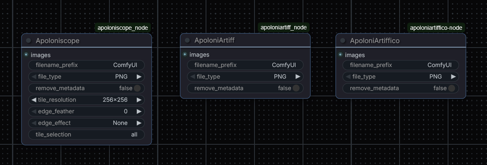
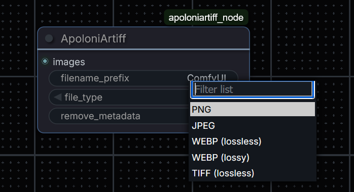
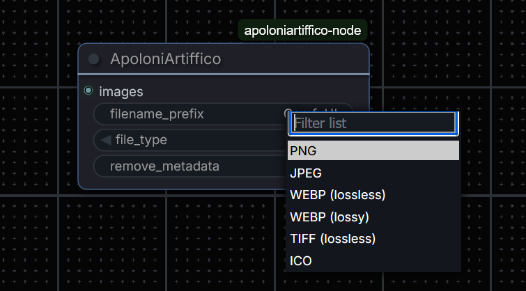

[](https://www.paypal.com/donate/?hosted_button_id=MG5S4EPK6EUSL)
# Apolonia Nodes

A collection of custom [ComfyUI](https://github.com/comfyanonymous/ComfyUI) nodes focused on flexible image export — supporting more file formats and giving you finer control over output, metadata, and image tiling.

---

## Nodes

| Node | File | Purpose |
|---|---|---|
| [ApoloniArtiff](https://github.com/ApoloniArt/Apolonia-Nodes/blob/main/apoloniartiff_node.py) | `apoloniartiff_node.py` | Save images in PNG, JPEG, WebP, or TIFF with metadata control |
| [ApoloniArtiffico](https://github.com/ApoloniArt/Apolonia-Nodes/blob/main/apoloniartiffico-node.py) | `apoloniartiffico-node.py` | Same as above, plus ICO format support |
| [Apoloniscope](https://github.com/ApoloniArt/Apolonia-Nodes/blob/main/apoloniscope_node.py) | `apoloniscope_node.py` | Tile slicer — split images into a grid, apply edge effects, and save selected tiles |

---

**How to use, simply download the zip or Git Clone:**
```bash
cd ComfyUI/custom_nodes
git clone https://github.com/ApoloniArt/Apolonia-Nodes
```

Unzip and place all 3 node .py files into your Custom Nodes folder, each as a single file.

---

## ApoloniArtiff

**File:** `apoloniartiff_node.py`  
**Category:** image

A drop-in replacement for the standard Save Image node with added format support and metadata handling.

### Inputs

| Input | Type | Default | Description |
|---|---|---|---|
| `images` | IMAGE | — | Image tensor(s) to save |
| `filename_prefix` | STRING | `"ComfyUI"` | Prefix for the output filename |
| `file_type` | ENUM | `PNG` | Output format (see below) |
| `remove_metadata` | BOOLEAN | `false` | Strip ComfyUI workflow/prompt metadata from the saved file |

### Supported Formats

| Format | Extension | Notes |
|---|---|---|
| PNG | `.png` | Lossless, compress level 4, supports full ComfyUI metadata |
| JPEG | `.jpg` | Lossy, quality 90 |
| WEBP (lossless) | `.webp` | Lossless WebP |
| WEBP (lossy) | `.webp` | Lossy WebP, quality 90 |
| TIFF (lossless) | `.tiff` | LZW-compressed TIFF; metadata stored in EXIF UserComment |

### Metadata Behaviour

- **PNG**: Prompt and extra workflow info stored as standard PNG text chunks.
- **TIFF / JPEG / WebP**: Metadata stored as a JSON blob in the EXIF `UserComment` field.
- Setting `remove_metadata = true` or launching ComfyUI with `--disable-metadata` suppresses all metadata embedding.

### Output Files

Files are saved to ComfyUI's configured output directory using the pattern:

```
{filename_prefix}_{counter:05}_.{extension}
```

---

## ApoloniArtiffico

**File:** `apoloniartiffico-node.py`  
**Category:** image

Identical to **ApoloniArtiff**, with the addition of **ICO format** support. Generate favicons or Windows icon files directly from a generation workflow.

### Inputs

| Input | Type | Default | Description |
|---|---|---|---|
| `images` | IMAGE | — | Image tensor(s) to save |
| `filename_prefix` | STRING | `"ComfyUI"` | Prefix for the output filename |
| `file_type` | ENUM | `PNG` | Output format (see below) |
| `remove_metadata` | BOOLEAN | `false` | Strip ComfyUI workflow/prompt metadata |

### Supported Formats

All formats from ApoloniArtiff, plus:

| Format | Extension | Notes |
|---|---|---|
| ICO | `.ico` | Windows icon format; no special arguments required |

### Notes on ICO

- ICO files are saved as-is without additional metadata embedding.
- For best results, feed images sized at standard icon dimensions (16×16, 32×32, 48×48, 64×64, 128×128, 256×256) into this node.
- Pillow handles multi-size ICO packing if you batch multiple images at different resolutions.

---

## Apoloniscope

**File:** `apoloniscope_node.py`  
**Category:** image

A tile slicer node. Takes an input image, divides it into a numbered grid of tiles, and saves them. You can select which tiles to output and apply edge effects (blur, fade, vignette, etc.) to the cut edges. Ideal for workflows that need to process or inspect large images in chunks.

### Inputs

| Input | Type | Default | Description |
|---|---|---|---|
| `images` | IMAGE | — | Image tensor(s) to process |
| `filename_prefix` | STRING | `"ComfyUI"` | Prefix for output filenames |
| `file_type` | ENUM | `PNG` | Output format (same options as ApoloniArtiff) |
| `remove_metadata` | BOOLEAN | `false` | Strip workflow metadata |
| `tile_resolution` | ENUM | `256x256` | Size of each tile |
| `edge_feather` | INT (0–100) | `0` | Feather/fade intensity applied to tile edges |
| `edge_effect` | ENUM | `None` | Visual effect applied at tile edges (see below) |
| `tile_selection` *(optional)* | STRING | `"all"` | Which tiles to output (see syntax below) |

### Tile Resolutions

`64x64`, `128x128`, `192x192`, `256x256`, `320x320`, `384x384`, `448x448`, `512x512`

Tiles are calculated by dividing the full image width and height by the selected tile size. Edge tiles that don't fill a full tile slot are cropped to fit.

### Edge Effects

| Effect | Description |
|---|---|
| `None` | No effect applied |
| `Blur` | Gaussian blur applied to the tile edges; intensity controlled by `edge_feather` |
| `Fade` | Edges fade to black |
| `Vignette` | Radial dark vignette from the tile centre outward |
| `Sharpen` | Sharpening applied at tile edges |
| `Emboss` | Emboss filter applied at tile edges |

`edge_feather` controls how strongly the effect blends — `0` means no feathering, `100` is maximum.

### Tile Selection Syntax

The `tile_selection` input accepts a comma-separated list of tile numbers or ranges. Tiles are numbered left-to-right, top-to-bottom starting at 1.

| Value | Meaning |
|---|---|
| `all` | Output all tiles (default) |
| `1,3,5` | Output tiles 1, 3, and 5 |
| `1-4` | Output tiles 1 through 4 inclusive |
| `1-3,7,10-12` | Combination of ranges and individual tiles |

### Output Files

For each image, the node saves:

1. **`{prefix}_{counter}_preview.{ext}`** — A copy of the original image with the tile grid and tile numbers drawn on as an overlay. Use this to identify tile numbers before making a selection.
2. **`{prefix}_{counter}_tiles.{ext}`** — A reconstructed image containing only the selected tiles (non-selected areas are black).
3. **`{prefix}_{counter}_tile{N}.{ext}`** — Individual files for each selected tile, only saved when a partial selection is made (i.e., not `all`).

### Metadata

When saving, Apoloniscope embeds an `apoloniscope_info` JSON field into the metadata containing:

```json
{
  "tile_resolution": "256x256",
  "selected_tiles": [1, 2, 3],
  "total_tiles": 12,
  "edge_feather": 10,
  "edge_effect": "Blur"
}
```

This is stored in PNG text chunks, or in the EXIF `UserComment` field for TIFF/WebP/JPEG.

### Example Workflow

1. Connect your sampler output to Apoloniscope's `images` input.
2. Run with `tile_selection = all` and `tile_resolution = 256x256`.
3. Check the `_preview` output to see tile numbering.
4. Re-run with a specific `tile_selection` (e.g., `"2,5,8"`) to extract only the tiles you need.
5. Apply an `edge_effect` (e.g., `Blur` with `edge_feather = 20`) to soften edges for inpainting or compositing.

---

## Shared Behaviour

All three nodes share the following:

- **Output node**: None of these nodes pass tensors back into the graph — they are terminal save nodes.
- **Counter**: Output files are auto-incremented using ComfyUI's standard `{counter:05}` scheme to avoid overwriting.
- **Metadata toggle**: All nodes respect both the per-node `remove_metadata` flag and ComfyUI's global `--disable-metadata` CLI flag.
- **Category**: All nodes are registered under the `image` category in the ComfyUI node browser.

---

## Dependencies

All dependencies are part of a standard ComfyUI installation:

- `Pillow` (PIL) — image processing and format encoding
- `numpy` — tensor-to-array conversion
- `comfy` — ComfyUI internals (`folder_paths`, `cli_args`)

No additional `pip install` required.

---

## License

See repository for licence details.

---

## Author

Made by [ApoloniArt](https://github.com/ApoloniArt).
